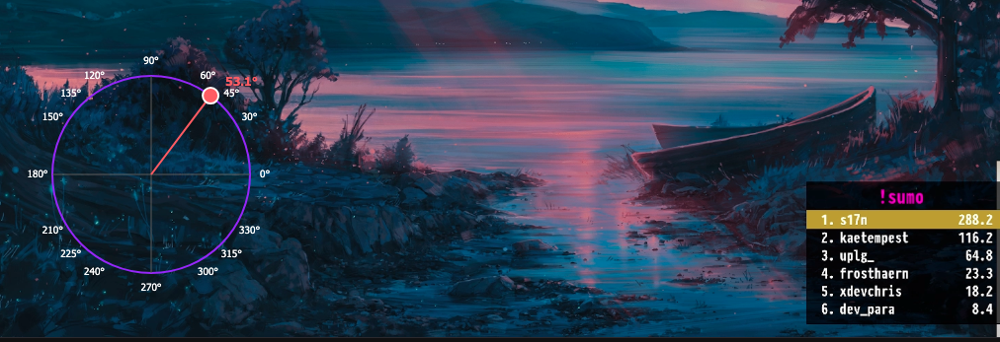

# Chrome/Firefox Extension for @s17n "Sumo"

Add a draggable trigonometric circle draggable on screen with a little dot to calculate the ideal angle.

Hit T (or t) or hit the tiny button in the right corner of the page to toggle the circle.

## Usage :

- Install dependencies :

```sh
npm install
```

- Build the extension :

```sh
npm run build
```

- Dev mode (don't forget to reload and refresh twitch on each change) :

```sh
npm run dev
```
